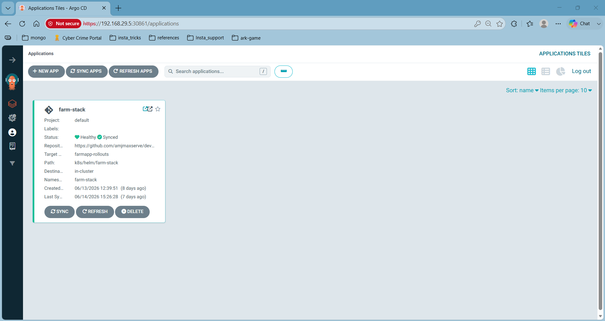
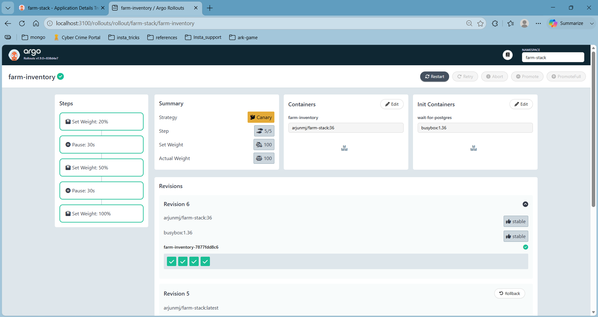
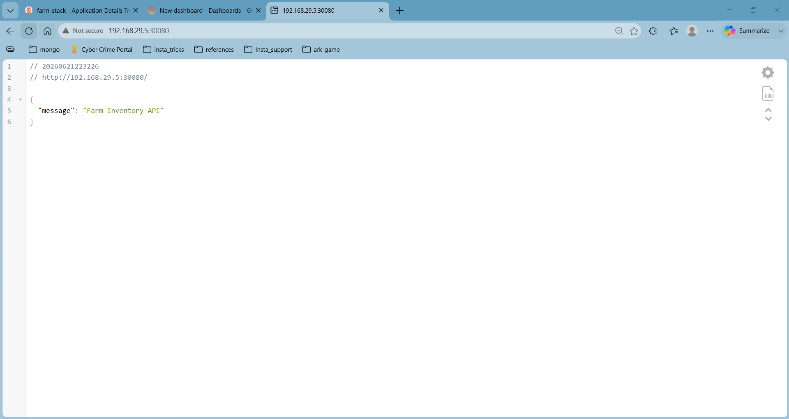
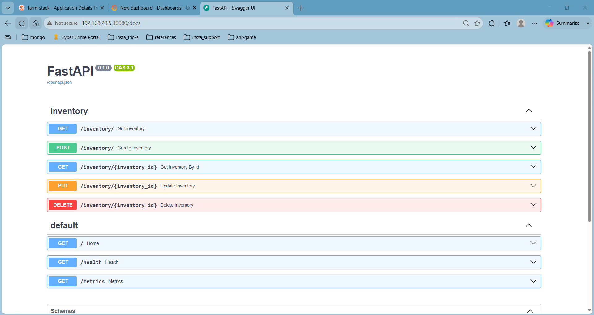

# Farm Inventory Platform

## Executive Summary

Farm Inventory Platform is a production-style Platform Engineering project designed to demonstrate how modern cloud-native platforms are built, deployed, secured, monitored, and operated using Kubernetes and GitOps practices.

The project evolved from a simple FastAPI inventory application into a complete Kubernetes platform supporting:

- Infrastructure as Code
- GitOps Delivery
- Progressive Delivery
- Autoscaling
- High Availability
- Security Controls
- Monitoring & Alerting
- CI/CD Automation

The objective is not merely to deploy an application, but to showcase real-world Platform Engineering responsibilities commonly performed in production environments.

```
## Platform Architecture

GitHub Repository
        │
        ▼
GitHub Actions
(Build → Scan → Push)
        │
        ▼
Docker Hub
        │
        ▼
ArgoCD
(GitOps Controller)
        │
        ▼
Helm Charts
        │
        ▼
Kubernetes Cluster
        │
 ┌──────┼─────────────┐
 ▼      ▼             ▼

FastAPI PostgreSQL Monitoring
 App      DB          Stack

                     ┌──────────────┐
                     │ Prometheus   │
                     │ Grafana      │
                     │ Alerts       │
                     └──────────────┘

Deployment Strategies

- Rolling Updates
- Canary
- Blue-Green
- Argo Rollouts

```
---

## Platform Capabilities

### Application Delivery

✅ Kubernetes Deployments

✅ Helm Package Management

✅ GitOps with ArgoCD

✅ Progressive Delivery

### Security

✅ RBAC

✅ Service Accounts

✅ Kubernetes Secrets

✅ Trivy Security Scanning

### Scalability

✅ Horizontal Pod Autoscaling

✅ Pod Disruption Budgets

### Observability

✅ Prometheus

✅ ServiceMonitor

✅ PrometheusRule

✅ Application Metrics

### Reliability

✅ Health Probes

✅ Rollback Support

✅ High Availability

### CI/CD

✅ GitHub Actions

✅ Docker Image Build

✅ Vulnerability Scanning

✅ Automated Deployments

---
## Technology Stack

### Application Layer

- FastAPI
- Python 3.12

### Database

- PostgreSQL

### Containerization

- Docker

### Orchestration

- Kubernetes

### Package Management

- Helm

### GitOps

- ArgoCD

### Progressive Delivery

- Argo Rollouts

### Monitoring

- Prometheus
- Grafana

### Security

- RBAC
- Service Accounts
- Secrets
- Trivy

### CI/CD

- GitHub Actions

### Networking

- Traefik Ingress

---

## CI/CD Pipeline

Implemented using GitHub Actions.

Pipeline Stages:

1. Build
2. Trivy Security Scan
3. Docker Image Push
4. Helm Deployment
5. Deployment Verification
6. Image Cleanup

Workflow:
```
Developer Push
        │
        ▼
Build Image
        │
        ▼
Trivy Scan
        │
        ▼
Push Docker Image
        │
        ▼
Deploy via Helm
        │
        ▼
Verify Deployment

```

---

## GitOps Workflow

The platform follows GitOps principles using ArgoCD.

Workflow:
```
Git Commit
      │
      ▼
GitHub Repository
      │
      ▼
ArgoCD Detects Change
      │
      ▼
Sync Helm Release
      │
      ▼
Kubernetes Updated
```

Features:

- Automatic Reconciliation
- Drift Detection
- Branch Isolation
- Self Healing

---

# Deployment Strategies

## Strategy 1: Standard Deployment

### Branch

main

### Features

* Kubernetes Deployment
* HPA Integration
* Rolling Updates

### Status

Validated Successfully

---

## Strategy 2: Manual Canary Deployment

### Branch

farmapp-canary

### Architecture

Stable Deployment
+
Canary Deployment

### Features

* Stable Pods
* Canary Pods
* Independent HPA
* Traffic Distribution

### Validation

Successfully tested:

* Stable Version (34)
* Canary Version (35)

Traffic distribution verified through API responses.

### Example

Version 34 → Stable

Version 35 → Canary

---

## Strategy 3: Blue-Green Deployment

### Branch

farmapp-bluegreen

### Architecture

Blue Environment
+
Green Environment

### Features

* Zero Downtime Switching
* Parallel Environments
* Safe Rollbacks

### Validation

Successfully synchronized using ArgoCD.

---

## Strategy 4: Argo Rollouts Canary

### Branch

farmapp-rollouts

### Architecture

Argo Rollout
↓
ReplicaSet
↓
Pods

### Features

* Progressive Delivery
* Traffic Weight Control
* Automated Rollout Steps
* HPA Integration

### Rollout Steps

20%
↓
Pause

50%
↓
Pause

100%
↓
Promotion

### Validation

Successfully tested:

* Replica management
* Rollout progression
* HPA integration
* Automated ReplicaSet management

---

# GitOps Implementation

## ArgoCD Applications

### Branch Isolation

Each deployment strategy is maintained in its own branch.

main
farmapp-canary
farmapp-bluegreen
farmapp-rollouts


---

## Monitoring & Observability

Monitoring stack implemented using Prometheus.

Coverage:

- Application Availability
- Pod Health
- Resource Utilization
- Database Status
- Alert Rules

Components:

- Prometheus
- ServiceMonitor
- PrometheusRule

---

## Security Controls

Implemented:

- RBAC
- Service Accounts
- Kubernetes Secrets
- Trivy Vulnerability Scanning

Security Goals:

- Least Privilege Access
- Secret Management
- Image Vulnerability Detection

---

## Scalability & Availability

Implemented:

- Horizontal Pod Autoscaler
- Pod Disruption Budget
- Readiness Probe
- Startup Probe
- Liveness Probe

Benefits:

- High Availability
- Self Healing
- Dynamic Scaling
- Zero Downtime Deployments

---

## Real-World Challenges Solved

### Helm Ownership Conflicts

Resolved ownership metadata issues during Helm migrations.

### Immutable Deployment Selectors

Resolved Kubernetes selector migration issues.

### HPA Selector Conflicts

Resolved autoscaling conflicts during canary deployments.

### Rollout Migration

Migrated standard Deployments to Argo Rollouts.

### Replica Management

Implemented conditional logic supporting HPA and non-HPA deployments.

---

## Project Outcomes

Successfully implemented:

✅ Docker

✅ Kubernetes

✅ Helm

✅ PostgreSQL

✅ GitHub Actions

✅ Trivy

✅ ArgoCD

✅ Argo Rollouts

✅ HPA

✅ PDB

✅ Prometheus

✅ GitOps

✅ Canary Deployments

✅ Blue-Green Deployments

Current Status:

Production-Ready Platform Engineering Demonstration Project

---

## Future Roadmap

### Multi Environment Promotion

Development
↓
QA
↓
Staging
↓
Production

### Advanced Rollouts

- Analysis Templates
- Automated Rollbacks
- Metric Based Decisions

### Security Enhancements

- Secret Scanning
- Dependency Scanning
- Policy Enforcement

---

## Screenshots 

### GitHub Actions CI/CD Pipeline


### GitOps with ArgoCD


ArgoCD continuously monitors Git repositories and synchronizes Kubernetes resources automatically.

### Progressive Delivery using Argo Rollouts

Canary deployment strategy demonstrating progressive traffic shifting and controlled promotion.

### Application Demo



### Application Docs 
